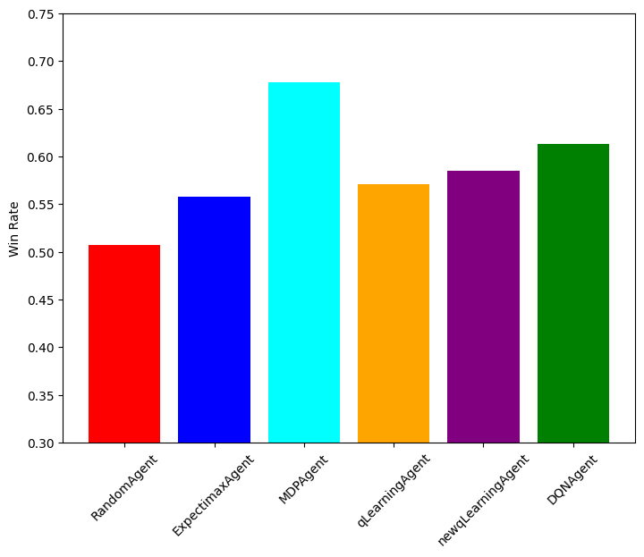
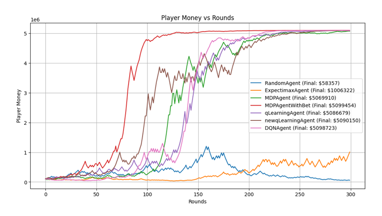
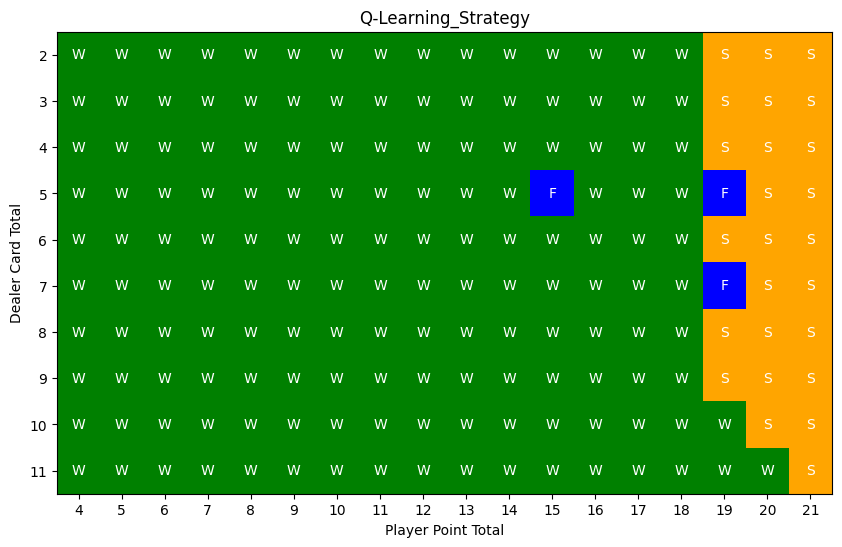
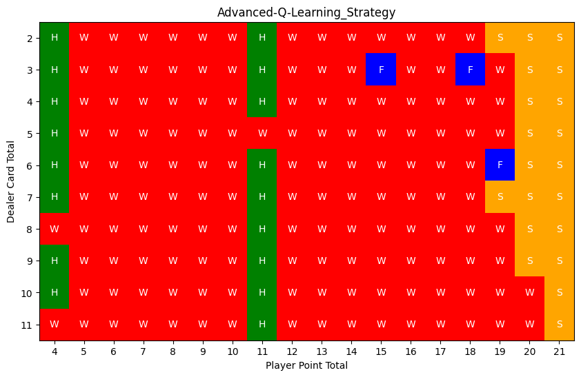

# Novel Blackjack Agents  
### (ShanghaiTech University CS181 Artificial Intelligence Final Project)  


## Table of Contents
- [Overview](#overview)
- [Game Rules Summary](#game-rules-summary)
- [Project Structure](#project-structure)
- [Installation](#installation)
- [Usage](#usage)
- [Experimental Results Summary](#experimental-results-summary)
- [License](#license)
- [Academic Honesty Notice](#academic-honesty-notice)
- [Authors](#authors)


This repository implements multiple AI agents for a redesigned Blackjack game with expanded actions and dynamic betting rules.  
Compared to classic Blackjack, our novel environment introduces a richer decision space suitable for reinforcement learning, adversarial search, and decision-theoretic approaches.

## Overview

We designed and evaluated several agents for our novel Blackjack game:

- **Random Agent**
- **Expectimax Agent**
- **MDP Agent**
- **MDPWithBet Agent** (bankroll-aware MDP)
- **Q-learning Agent**
- **Improved Q-learning Agent** (with refined reward function)
- **DQN Agent**

Our redesigned Blackjack includes:

- **Four actions:** `Hit`, `Stay`, `Switch`, `Fold`
- **Dynamic betting rules**
- **Casino-style simulation environment**

This makes the game a significantly richer platform for studying decision-making under uncertainty.

## Game Rules Summary

### Player Actions
- **Hit:** Draw a card  
- **Stay:** Stop drawing  
- **Switch:** Swap one card with the dealer  
- **Fold:** Hide one of the dealer’s cards  

### Dealer Rule
- Dealer hits until the hand value reaches **17 or higher**

### Dynamic Betting System
The base bet ratio starts at 10% of the player’s bankroll and is adjusted by:
- Whether the player or dealer has an Ace/10
- Win/loss streaks
- A random multiplier in \[0.9, 1.1\]

This introduces stochasticity and long-term strategy considerations.

# Project Structure

```text
Project/
├── Agent/
│   ├── ...
├── Game/
│   └── BlackJack.py
├── Images/
│   ├── winrate.png
│   ├── bet_comparison.png
│   ├── qtable_original.png
│   └── qtable_new.png
├── BlackJack.ipynb
├── README.md
├── report.pdf
└── requirements.txt
         
```

# Installation
### 1. Clone the repository

```bash
git clone https://github.com/zhengmh2023/Novel-BlackJack-Agents.git
cd Novel-BlackJack-Agents
```

### 2. Create and activate a conda environment

```bash
conda create -n blackjack python=3.10 -y
conda activate blackjack
```

### 3. Install dependencies
```bash
pip install -r requirements.txt
```
## Usage

To run the project, simply open the Jupyter notebook:

```bash
jupyter notebook BlackJack.ipynb
```

## Experimental Results Summary

We conducted two evaluation stages:

### 1. Win-rate Comparison

Ranking from lowest to highest win rate:

1. Random  
2. Expectimax  
3. Q-learning  
4. Improved Q-learning  
5. DQN  
6. MDP  

### 2. Casino Betting Simulation

- **MDPWithBet** converged fastest in bankroll growth  
- **DQN** outperformed tabular Q-learning due to generalization  
- **Improved Q-learning** displayed more diverse actions  
- **Expectimax** underperformed due to shallow lookahead limits  

## Sample Results

### Win Rate Comparison


### Bankroll Growth in Betting Simulation


### Q-Table of Original Q-learning Agent


### Q-Table of Improved Q-learning Agent



Detailed plots and explanations are available in `report.pdf`.


## License

This project is intended to be open-sourced under the **MIT License**.  


## Academic Honesty Notice

This project was originally developed for the **ShanghaiTech University CS181 Artificial Intelligence** course.  
Please **do not submit this code** as your own coursework.


## Authors

- Meihan Zheng  
- Tianyu Gu  
- Yatu Zhang  

For additional details, refer to the final report (`report.pdf`).

